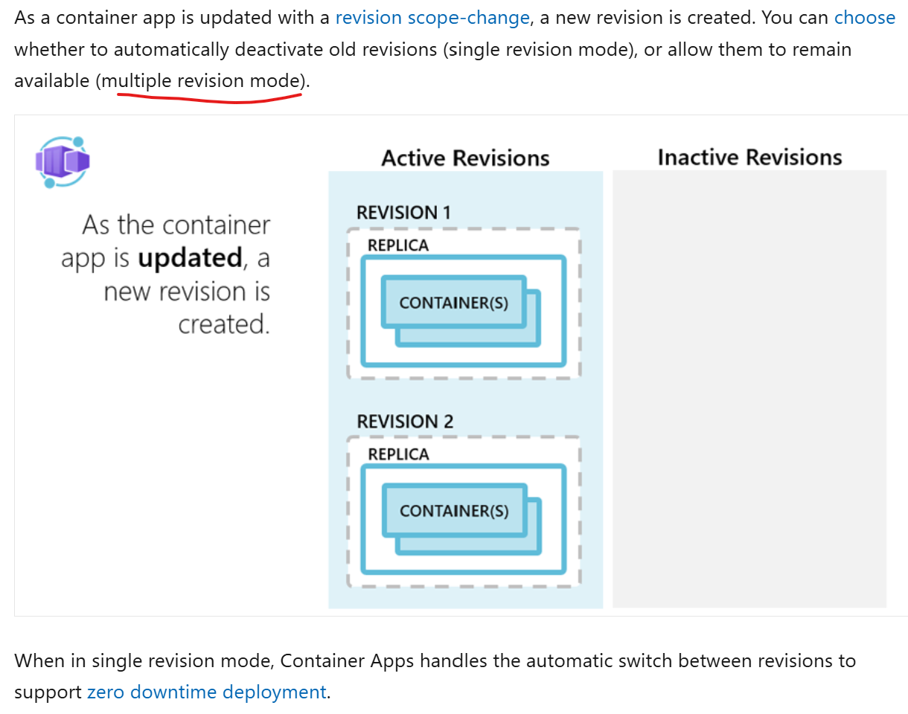
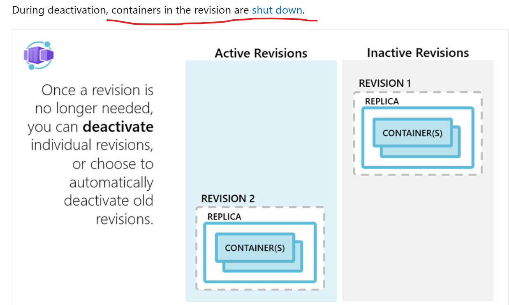

### Use Case: Canary Deployment for a Web Application

#### Solution: Leveraging Labels and Revisions for Traffic Splitting

Azure Container Apps provides a powerful mechanism for managing application changes using revisions and labels. Revisions allow you to create immutable snapshots of your application, and labels enable you to manage and route traffic between these revisions.

#### Step-by-Step Implementation

1. **Create Initial Deployment, label new revision and set traffic weight for the label to 100%**

   
   srinmantest.azurecr.io/bookstoreapi:v1 and srinmantest.azurecr.io/bookstoreapi:v2 are the images for the web application. Please change this to your image.  
   First, deploy your initial version of the web application to Azure Container Apps.

   IMPORTANT: revision-mode must be set to multiple. This allows you to create multiple revisions of the same application.  


   ``` 
   uami_id=$(az identity show --resource-group academorg --name acaacrpulluami --query id --output tsv)
   ```
   Assign AcrPull role for this identity to the ACR where the image is stored.
   ```bash

   az containerapp create --name acabookstoreapi --resource-group academorg --environment acaenv1 --workload-profile-name "Consumption" --image srinmantest.azurecr.io/bookstoreapi:v1 --target-port 5000 --ingress external --revisions-mode multiple --revision-suffix v1 --query properties.configuration.ingress.fqdn --registry-identity $uami_id --registry-server srinmantest.azurecr.io --min-replicas 1 --max-replicas 3    

   az containerapp revision label add --label stable --name acabookstoreapi --resource-group academorg --revision acabookstoreapi--v1 
   az containerapp revision list --name acabookstoreapi --resource-group academorg  -o table

   az containerapp ingress traffic set --name acabookstoreapi --resource-group academorg --label-weight stable=100
   az containerapp revision list --name acabookstoreapi --resource-group academorg -o table

   ```

2. **Deploy New Version**

   Deploy the new version of your web application. This will create a new revision.

   ```bash
   az containerapp update --name acabookstoreapi --resource-group academorg --image srinmantest.azurecr.io/bookstoreapi:v2 --min-replicas 1 --max-replicas 3 --revision-suffix v2 
   az containerapp revision label add --label canary --name acabookstoreapi --resource-group academorg --revision acabookstoreapi--v2
   ```

3. **List Revisions and Review traffic split**

   List the revisions to get the names of the current and new revisions.


   az containerapp revision list --name my-web-app --resource-group my-resource-group --query "[].{name:name, active:active}" -o table   

   ```bash
   az containerapp revision list --name acabookstoreapi --resource-group academorg 
   az containerapp revision list --name acabookstoreapi --resource-group academorg -o table
   ```
   
   Review the traffic split between the stable and canary revisions.

   Open browser and navigate to the URL of the web app. You should see the response from the stable revision.   url/authors
   
   ```bash
   az containerapp revision list --name acabookstoreapi --resource-group academorg --query "[].properties.fqdn" -o tsv
   ```
   You can see fqdn for both the revisions.   Portal should also display label URL.  At this time, you can test the canary revision by accessing it directly using its label URL. 

   When you are ready to start the canary deployment, you can set the traffic weight for the canary revision to a small percentage (e.g., 10%) and the stable revision to 90%. This allows you to gradually roll out the new version while still serving most of your users with the stable version.  Follow the steps below to set the traffic weight.


4. **Configure Traffic Splitting**

   Split the traffic between the stable and canary revisions. For example, route 90% of the traffic to the stable version and 10% to the canary version.

   az containerapp ingress traffic set --name my-web-app --resource-group my-resource-group --traffic-weight stable=90 canary=10
  
   ```bash
   az containerapp ingress traffic set -n acabookstoreapi -g academorg --label-weight stable=90 canary=10
   ```

5. **Monitor and Validate**

   Monitor the performance and stability of the canary revision using Azure Monitor or Application Insights. Ensure that the new version is functioning correctly and does not introduce any issues.

6. **Gradually Increase Traffic**

   If the canary revision is stable, gradually increase the traffic to the canary revision until it receives 100% of the traffic.

   ```bash
   az containerapp ingress traffic set --name my-web-app --resource-group my-resource-group --traffic-weight stable=50 canary=50
   az containerapp ingress traffic set --name my-web-app --resource-group my-resource-group --traffic-weight stable=0 canary=100
   az containerapp ingress traffic set -n acabookstoreapi -g academorg --label-weight stable=50 canary=50
   az containerapp ingress traffic set -n acabookstoreapi -g academorg --label-weight stable=0 canary=100


   ```

7. **Promote Canary to Stable**

   Once the canary revision is fully validated, promote it to the stable label. Label swap helps with this. 

   ```bash
   az containerapp revision label swap --name acabookstoreapi --resource-group academorg --source canary --target stable
   ```

8. **Deactive old revision**

   Old revision is not needed anymore. Deactivate it. Active revisions cost money.

   ```bash
   az containerapp revision deactivate --name acabookstoreapi --resource-group academorg --revision acabookstoreapi--v1
   ```

### Conclusion

By leveraging labels and revisions in Azure Container Apps, you can effectively manage application changes and perform canary deployments with traffic splitting. This approach allows you to gradually roll out new versions of your application, monitor their performance, and ensure stability before fully deploying them to all users. This method simplifies the deployment process and reduces the risk of introducing issues in production.