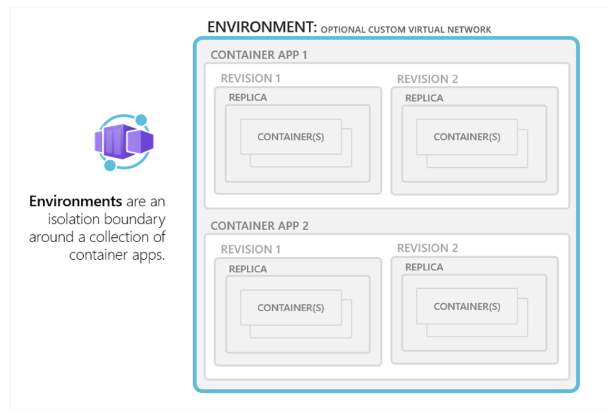
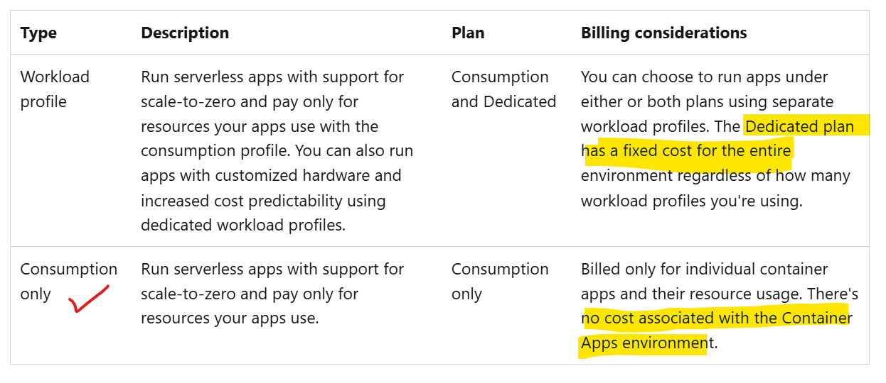
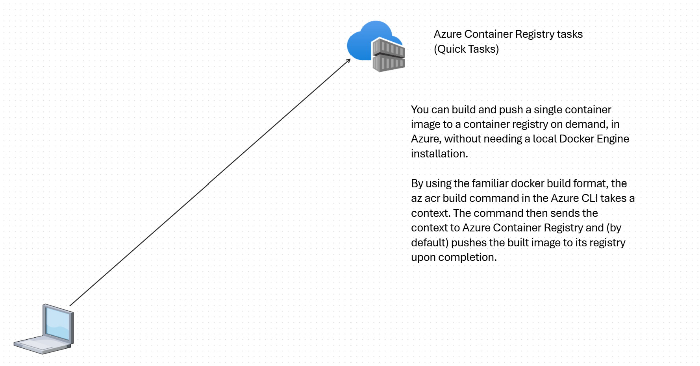
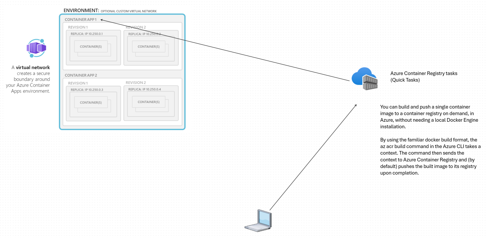
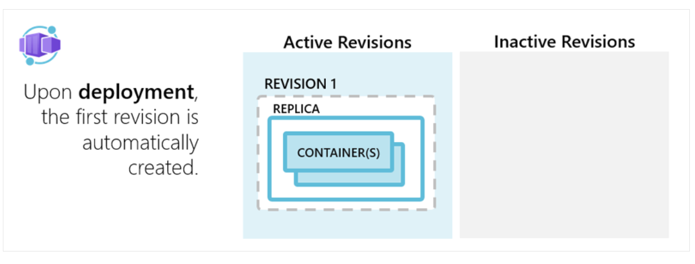
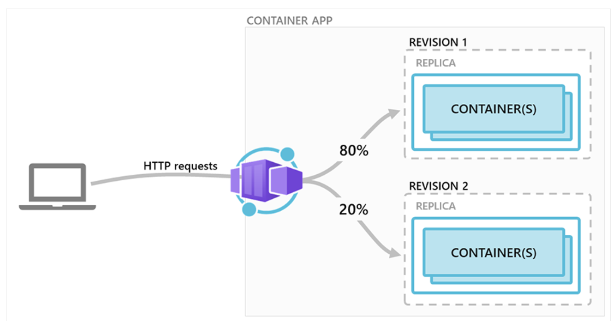
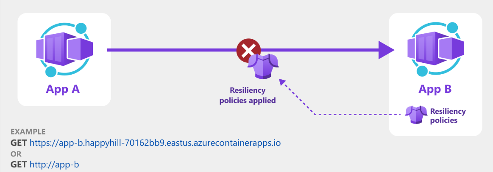
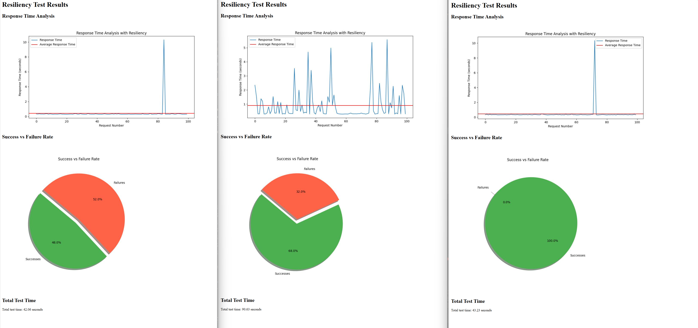
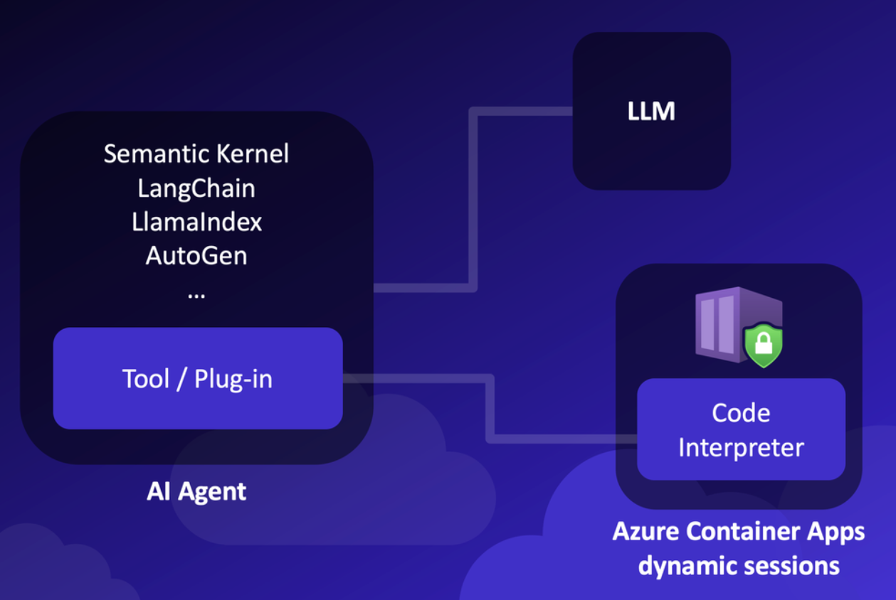

# ACA  

## Goal

The goal of this demo is to understand the basics of Azure Container Apps (ACA). It provides a simple and easy-to-use interface for deploying and managing containerized applications.   

Use simple CLI commands and Azure portal to create and manage containerized applications.

## Non-Goals

- Custom made complex app demos
- Introduce IaC tools such as Terraform or ARM templates or Bicep

## Demo objectives 

We are going to create a new demo from scratch. Purpose of this demo is to understand the basics of ACA.

- Create an ACA environment 
- Build a container image (from a simple python app) and push it to ACR
- Create a containerapp in the environment
- Access the containerapp from the public internet
- Understand built-in security features of ACA (such as peer-to-peer encryption for addressing in-transit encryption)
- Understand Ingress concepts in ACA
- Understand Revisions and Traffic splitting in ACA
- Understand built-in autoscaling and serverless model of ACA
- ACA environment with resiliency features such as retries


- APIM and ACA


## Create ACA environment





```
az containerapp env create --name acaenv1 -g academorg --location westus2  --internal-only false --enable-peer-to-peer-encryption
   
```

**ACA's distinct feature : enable-peer-to-peer-encryption forces in-transit encryption for the entire ACA environment. In an AKS cluster (or any K8S cluster), this is not possible without installing a service mesh like Istio. This is a built-in feature of ACA. You can already see the simplicity of ACA while providing security features.**

## Build a container image and push it to ACR

 

cd to acabookstoreapi folder and run the following commands.  
```
az acr build --registry srinmantest --image bookstoreapi:v1 --file Dockerfilev1 .
az acr build --registry srinmantest --image bookstoreapi:v2 --file Dockerfilev2 .
az acr build --registry srinmantest --image bookstoreapi:v3 --file Dockerfilev3 .
az acr build --registry srinmantest --image bookstoreapi:flaky --file Dockerfileflaky .
```
Please review the python code in the folder. It is a simple python app that returns a list of books or authors.

## Create a containerapp in the environment  


Note: acaacrpulluami UAMI has been already created and assigned Acrpull role to the Azure container registry srinmantest.



Change rg and name as needed  
``` 
uami_id=$(az identity show --resource-group academorg --name acaacrpulluami --query id --output tsv)
```


Create a containerapp in the environment.  


```
az containerapp create --name aca1bookstoreapi --resource-group academorg --environment acaenv1 --workload-profile-name "Consumption" --image srinmantest.azurecr.io/bookstoreapi:v1 --target-port 5000 --ingress external --revisions-mode multiple --revision-suffix v1 --query properties.configuration.ingress.fqdn --registry-identity $uami_id --registry-server srinmantest.azurecr.io --min-replicas 1 --max-replicas 3 
```

**ACA's distinct feature : Container Apps is a resource in Azure Resource Manager (ARM) that provides a simplified way to deploy and manage containerized applications. You don't need to use Kubernetes API objects like Pods, Deployments, or Services. Instead, you use the Azure CLI or Azure portal to create and manage Container Apps.**

### Command Explanation:

1. **`az containerapp create`**:
   - This is the Azure CLI command to create a new Azure Container App.

2. **`--name acabookstoreapi`**:
   - Sets the name of the Container App to "acabookstoreapi".

3. **`--resource-group academorg`**:
   - Specifies the resource group "academorg" where the Container App will be created. Resource groups are used to group related resources for an Azure solution.

4. **`--environment academoenvw2con`**:
   - Specifies the environment "academoenvw2con" for the Container App. Environments in Azure Container Apps provide a way to manage and configure multiple container apps together.

5. **`--workload-profile-name "Consumption"`**:
   - Sets the workload profile to "Consumption". This profile is typically used for apps that have variable workloads and need to scale based on demand.

6. **`--image srinmantest.azurecr.io/bookstoreapi:v1`**:
   - Specifies the container image to use, located at "srinmantest.azurecr.io/bookstoreapi:v1". This is the image that will be deployed in the Container App.

7. **`--target-port 5000`**:
   - Sets the target port for the container to 5000. This is the port on which the application inside the container will listen for incoming requests.

8. **`--ingress external`**:
   - Configures the app to have external ingress, making it accessible from the internet.

9. **`--revisions-mode multiple`**:
   - Enables multiple revisions for the Container App. This allows you to manage different versions of your app.

10. **`--revision-suffix v1`**:
    - Adds a suffix "v1" to the revision name. This helps in identifying the specific revision of the app.

11. **`--query properties.configuration.ingress.fqdn`**:
    - Queries the fully qualified domain name (FQDN) of the ingress configuration. This will return the FQDN where the app can be accessed.

12. **`--registry-identity $uami_id`**:
    - Uses the identity specified by the environment variable `$uami_id` to access the container registry. This is typically a managed identity that has permissions to pull images from the registry.

13. **`--registry-server srinmantest.azurecr.io`**:
    - Specifies the container registry server "srinmantest.azurecr.io". This is where the container image is stored.

14. **`--min-replicas 1`**:
    - Sets the minimum number of replicas to 1. This ensures that at least one instance of the app is always running.

15. **`--max-replicas 3`**:
    - Sets the maximum number of replicas to 3. This allows the app to scale out to a maximum of three instances based on demand.


If you need to change the # of replicas:  
```  
az containerapp update --name aca1bookstoreapi --resource-group academorg --min-replicas 1 --max-replicas 3  
```
Deploy another app for serverless demo. 

```
az containerapp create --name aca1bookstoreapimin0 --resource-group academorg --environment acaenv1 --workload-profile-name "Consumption" --image srinmantest.azurecr.io/bookstoreapi:v1 --target-port 5000 --ingress external --revisions-mode multiple --revision-suffix v1 --query properties.configuration.ingress.fqdn --registry-identity $uami_id --registry-server srinmantest.azurecr.io --min-replicas 0 --max-replicas 3 
```


## Access the containerapp from the public internet

The command above will return the FQDN where the app can be accessed. You can use this FQDN to access the app from the public internet.
```
az containerapp show --name acabookstoreapi --resource-group academorg --query properties.configuration.ingress.fqdn --output tsv
```

**ACA's distinct feature : ACA provides a simple way to expose containerized applications to the public internet. You don't need to configure complex networking or load balancers. The FQDN returned by the command is the public endpoint where the app can be accessed.**

### Enforcing IP address restriction

for added protection, you can use the following command to restrict access to the containerapp to a specific IP address range. 

```
curl ifconfig.me   
az containerapp ingress access-restriction set --name aca1bookstoreapi --resource-group academorg --rule-name allowSpecificIP --ip-address 135.134.199.24 --action Allow
```

**ACA's distinct feature : ACA provides built-in IP address restriction capabilities to control access to containerized applications. This feature allows you to restrict access to specific IP addresses or ranges, providing an additional layer of security for your applications. In AKS or K8S, you would need to configure network policies or NSG to achieve similar functionality.**


##  Understand Ingress concepts in ACA




```
az containerapp ingress show --name aca1bookstoreapi --resource-group academorg
```

## Understand Revisions and Traffic splitting in ACA

academo/acacanarydeployment.md  

## Resiliency features  



```
az containerapp create --name aca1bookstoreflaky --resource-group academorg --environment acaenv1 --workload-profile-name "Consumption" --image srinmantest.azurecr.io/bookstoreapi:flaky --target-port 5000 --ingress external --revisions-mode multiple --revision-suffix v1 --query properties.configuration.ingress.fqdn --registry-identity $uami_id --registry-server srinmantest.azurecr.io --min-replicas 1 --max-replicas 1
```

Turn 'Developer tools' on.    
Get url and call endpoint /unstable-endpoint  

Run the following python script to test the resiliency feature.

change ENDPOINT = "https://acabookstoreflaky.salmonglacier-101b4341.westus2.azurecontainerapps.io/unstable-endpoint" as needed.
```
cd ~/git/aca/academo
python resiliencytest.py
```


```
az containerapp resiliency create --resource-group academorg --name defaultpolicy --container-app-name acabookstoreflaky  --recommended
```

You should notice the retries in the response.

Run the python script again to see the retries in action.  
```
cd ~/git/aca/academo
python resiliencytest.py
```

Let's tweak the resiliency policy.  

- increase max retries to 10 to improve the chances of success
- bring down the delay (initialDelayInMilliseconds and maxIntervalInMilliseconds) to 2 msec to speed up the retries
- increase the consecutiveErrros to 10 to improve the chances of success

Review resiliencypolicy.yaml file.

```
az containerapp resiliency update --resource-group academorg --name defaultpolicy --container-app-name aca1bookstoreflaky --yaml resiliencypolicy.yaml
```

Run the python script again to see the retries in action.  
```
cd ~/git/aca/academo
python resiliencytest.py
```

Sample test results:  
First run: No policy  
Second run: Default policy with recommended settings  
Third run: Custom policy with tweaked settings  


Delete the resiliency policy.  
```
az containerapp resiliency delete --resource-group academorg --name defaultpolicy --container-app-name aca1bookstoreflaky
```

## Dynamic Sessions 


```
az containerapp sessionpool create --name my-session-pool --resource-group academorg --location westus2 --container-type PythonLTS --max-sessions 100 --cooldown-period 300 --network-status EgressDisabled

az containerapp sessionpool show --name my-session-pool --resource-group academorg --query 'properties.poolManagementEndpoint' -o tsv

az account get-access-token --resource https://dynamicsessions.io 
```

### POST request to execute code in a session
Following is a sample request to execute code in a session. 
```
POST https://<REGION>.dynamicsessions.io/subscriptions/<SUBSCRIPTION_ID>/resourceGroups/<RESOURCE_GROUP>/sessionPools/<SESSION_POOL_NAME>/code/execute?api-version=2024-02-02-preview&identifier=<SESSION_ID>
Content-Type: application/json
Authorization: Bearer <token>

{
    "properties": {
        "codeInputType": "inline",
        "executionType": "synchronous",
        "code": "print('Hello, world!')"
    }
}
```

### Python script to test dynamic sessions  

Use python script dynamicsessions.py to test the dynamic sessions feature. You don't need to change python code but need to set the AUTHORIZATION_TOKEN environment variable. Use this command to set the AUTHORIZATION_TOKEN environment variable.
```
export AUTHORIZATION_TOKEN=$(az account get-access-token --resource https://dynamicsessions.io --query accessToken --output tsv)
```

Run the python script.   This python basically sends a request to the dynamic sessions endpoint to execute a simple python code.
```
python dynamicsessions.py
```